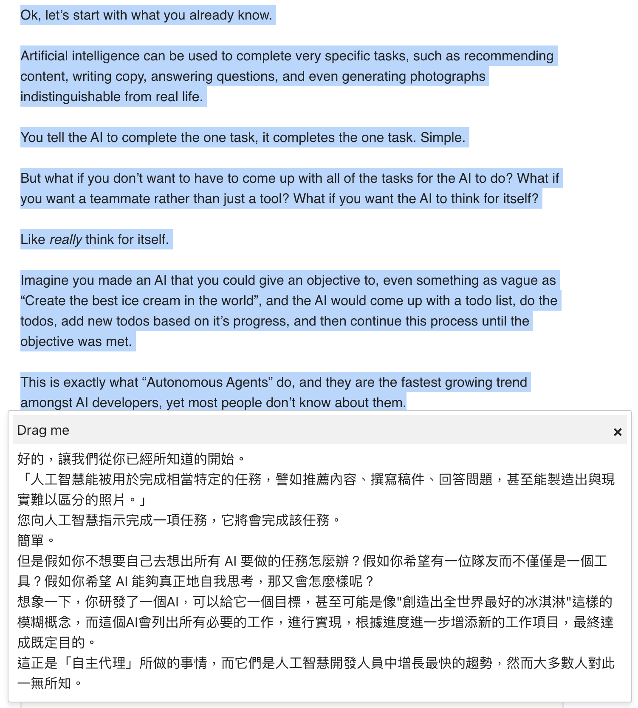
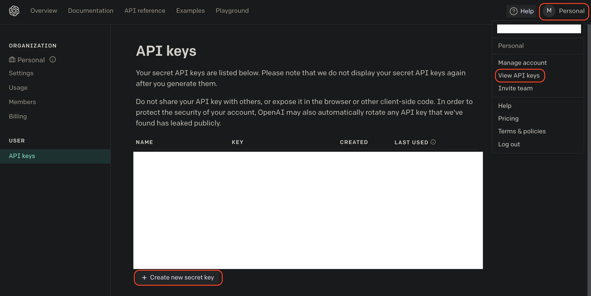
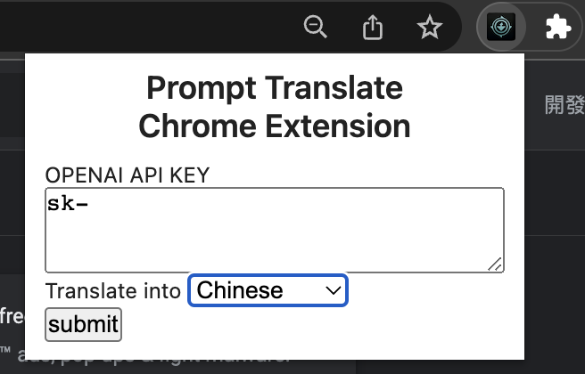

#  Prompt Translate Chrome Extension
[中文說明文件](./README_tw.md)

Welcome to the "Prompt Translator" Chrome extension! Ever been on a website and 
stumbled upon content in a foreign language? With this extension, those days of copy-pasting into 
a translator are gone. Simply highlight the text, and voila, instant translation in your desired 
language, all powered by ChatGPT.

[Blog](https://about.armcortex.cc/post/prompt-translate-chrome-extension/)

## 🎯 Features
- **Instant Translations with ChatGPT:** Highlight any text on your browser and get an instant translation in a pop-up. Neat, right?
- **Support for Multiple Languages:** Japanese, German, French and more – We've got them all covered.
- **Learning Mode:** Dive deeper into language learning. This tool not only translates but also offers insights to better understand and learn.

## DEMO


## Support Language
- Chinese
- Japanese
- English
- Arabic
- German
- French
- Hindi
- Italian
- Korean
- Portuguese
- Spanish

## Prerequisites
- [OpenAI API Key](https://beta.openai.com/)


## How to use
1. Get OpenAI API Key and copy it


2. Click the extension icon and paste the API Key 
3. Select the language you want to translate to and submit


1. Select the text you want to translate in the web page
2. Right click and select "Prompt Translator"
3. You can use "Drag me" to drag the UI


## How to install
### Download from Release
1. Download the latest release zip file from [here](https://github.com/armcortex/prompt-translate-chrome-extension/releases/download/v0.1.0/prompt-translate-chrome-extension-v0.1.0.zip)
2. Unzip the file
3. Open Chrome and go to `chrome://extensions/`
4. Enable "Developer mode" if it's not enabled
5. Click "Load unpacked" and select the unzipped folder

### Build from source
1. Get Docker [here](https://www.docker.com/)
1. Clone the repository
   ```bash
   git clone https://github.com/armcortex/prompt-translate-chrome-extension
   ```
2. `cd` change directory to the `scripts` folder
3. Run `build_project.sh` to build the project
4. Open Chrome and go to `chrome://extensions/`
5. Enable "Developer mode" if it's not enabled
6. Click "Load unpacked" and select the `project/build` folder

---

This project was bootstrapped with [Chrome Extension CLI](https://github.com/dutiyesh/chrome-extension-cli)

