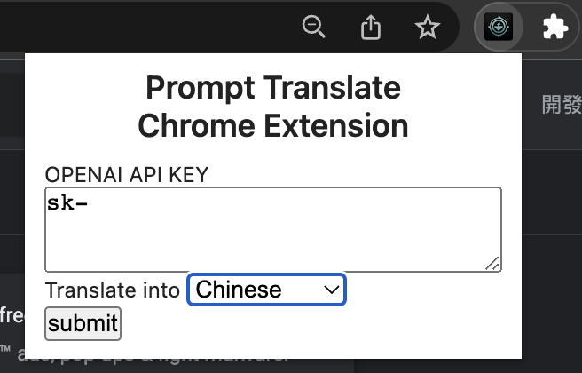

#  詠唱翻譯Chrome擴充功能
[English Readme](./README.md)

歡迎使用 "Prompt Translator" Chrome 擴充功能！是否曾在網站上遇到外語內容而感到困惑？有了這個擴充功能，你不再需要複製和貼上到翻譯工具中。只需突出顯示文本，瞬間就能翻譯成你想要的語言，全部都由 ChatGPT 提供支持。

[Blog](https://about.armcortex.cc/post/prompt-translate-chrome-extension/)


## 🎯 功能
- **ChatGPT 即時翻譯：** 在你的瀏覽器上突出顯示任何文本，並在彈出窗口中獲得即時翻譯。很酷，對吧？
- **支持多種語言：** 日語、德語、法語等等 — 我們全部都支持。
- **學習模式：** 更深入地學習語言。這個工具不僅僅是翻譯，還提供洞察，幫助你更好地理解和學習。


## 演示


## 支援語言
- 中文
- 日語
- 英語
- 阿拉伯語
- 德語
- 法語
- 印地語
- 意大利語
- 韓語
- 葡萄牙語
- 西班牙語

## 前置作業
- [OpenAI API Key](https://beta.openai.com/)

## 如何使用
1. 取得OpenAI API Key並複製它


2. 點擊擴充功能圖標並貼上API Key
3. 選擇要翻譯成的語言並提交


4. 選擇網頁中要翻譯的文本
5. 右鍵單擊並選擇"Prompt Translator"
6. 您可以使用"Drag me" 來拖動UI

## 如何安裝
### 從發行版本下載
1. 從[這裡](https://github.com/armcortex/prompt-translate-chrome-extension/releases/download/v0.1.0/prompt-translate-chrome-extension-v0.1.0.zip)下載最新版本zip檔案
2. 解壓縮zip檔案
3. 打開Chrome，網址輸入`chrome://extensions/`
4. 啟用"開發人員模式"（如果尚未啟用）
5. 點擊"載入未打包擴充功能"，然後選擇解壓縮的文件夾

### 從原始碼編譯
1. 在[此處](https://www.docker.com/)獲取 Docker
2. 下載存儲庫
   ```bash
   git clone https://github.com/armcortex/prompt-translate-chrome-extension
   ```
3. `cd`切換目錄到`scripts`文件夾
4. 運行 `build_project.sh`以編譯專案
5. 打開Chrome，網址輸入`chrome://extensions/`
6. 啟用"開發人員模式（如果尚未啟用）
7. 單擊"載入未打包擴充功能"，然後選擇`project/build`文件夾

---

This project was bootstrapped with [Chrome Extension CLI](https://github.com/dutiyesh/chrome-extension-cli)